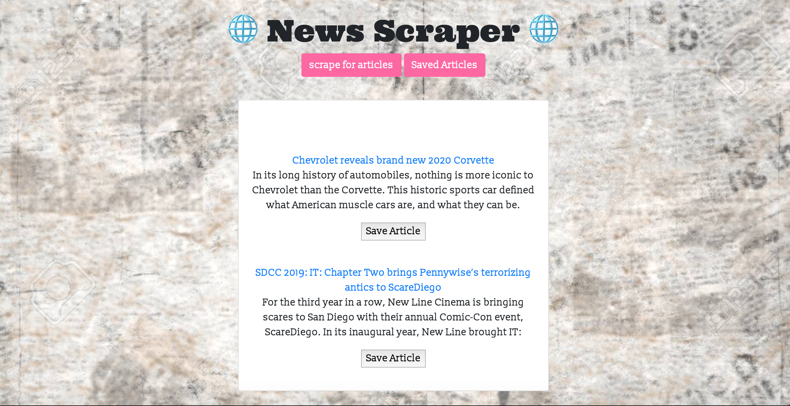

# MongoDB_Scraper

This web app lets users view and save the articles to read them later, after they done reading they have option to leave cpmment or delete the article.

This app was built with Mongoose and Cheerio to scrape new from the web.

## INSTRUCTION FOR THE USER.

When first time launching the app, page will show some articles, when the scrape for the articles button is pressed, page will populate the lates articles.

The user is able to go through the articles and eiter click on the text to leave a comment or save the article for later reading.

After user pressed save button, saved article will go tho the saved article page, whne user will have the option to delete the article after reading.

This app can be run on a local server or it can be found on heroku, https://newscraper200000.herokuapp.com/